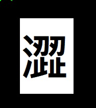

# 新黑澀會公告
# 新黑澀會
# 傑邦上兵繼任會長
# 1. 新黑澀會, 勝率未達50%, 未經允許, 不得參賽!
# <a href="https://www.youtube.com/channel/UC-PHMjrhrDjeInhwoXv4pxA/live">會長勝率七成直播(24小時直播)

# 會長戰功: 戲谷名人堂高手

# 會規 :首重會員間禁止貨幣買賣致生事, 因而影響公會運作品質
# 公會成立之初, 百廢方興待舉, 會規之解釋,由會長決議爭議!
# (一)基本場次獎( 二十場為會員基本義務,公會戰負分者,不能領任何獎項,並回補支領名次獎金於共同帳戶中 )
# 增加獎(三十場正分獎一萬)試行二個月
# 一. 滿四十五場正分者獎5萬麻將金幣
# 二. 滿七十場正分者獎10 萬麻將金幣
# 三. 滿百場正分者20 萬麻將金幣
# (二)會內獎,人數不足二十人不適用之!
# 四. 公會前三名者獎30, 20, 10 (麻將金幣)
# 人數不足二十人不適用之!
# 註( 若為民事性質之合約者, 特定雇庸性質會員不適用之 )
# 註:未連續二次公會戰者, 視同雇庸性質, 僅能領百場正分獎項
# (三)特別獎
# 五. 搶分王 30萬
# 六. 出手王( 正分者 30萬)
# 公會戰賞金記事 ( 會長有最終決定權限 )
# 普勢+10(4/12公)
# 美女蘇 +4(4/12公)
# ex-bank +(3/31公5)+3(4/11)
# 傑邦土包子+3(3/8)+3(3/21)
# 水箭龜  +(2/16公1),水箭龜+3(2/26)+3(2/27)+3(3/3)+5(3/18公)+3(3/21)+3(3/22)+3(3/28)+(3/31公10)+10(4/12公)-8(4/17提)
# 英九馬+3(2/25)
# 代客補血+3(3/23)
# 傑邦上兵+3(2/21)
# 龍          共計20萬
# 獅爺LEO     共計55萬+公20+私18+(2/16公20)+(3/3公20)+特別金(16)+(3/16公20)+特別金(12)+5(會特)+(3/31公20)+10(4/12公)
# lingoce    共計20萬 ( www.lingoce.top 一年期) +3萬(會長獎)+3+公20+3(2/8+(2/16公20)+3(2/21)+3(3/6)+3(3/8)+3(3/9)+3(3/11)+3(3/13)+3(3/18)+3(3/23)
# 酷ano      共計15萬+3(2/14)++(2/16公10)+3(2/25)+1(4/12公-10(4/17)
# (茫)         共計11萬 (註:未滿公會戰二次, 視同庸兵, 不能領獎)
# 娃愛妳       共計20萬
# 夜千雪       共計1萬
# 御翹楚           共計7萬+公10
# 滿嬴錢         +3萬(會長獎)+5(3/18公)
# 迷江督門       +3萬(1/30)+3(1/31)
# 紫陽天 (公20)+(3/3公20)+(3/18公20)+5(4/12公)
# 音速小子     +公10(註:已滿公會戰二次, 可領獎)
# 友緣+1(2/16公), 友緣連續二次會戰, 可得45場正分獎,目前不能領五萬!
# 依玲蔡       +3(3/28)
# 網聚黑澀會網聚(一)
# <a href="mailto:tfftfftff7788@yahoo.com.tw">會外事務</a>
# XCH
# xch1km6haeqcqknxkhwj5g4asd0u3na0026ucxdzzl586h0mn0rqj0gqwpcz7g
# 會長管理技術支援(Msdn.net): jetbomb2012@gmail.com 
# <a href="mailto:jetbomb2012@gmail.com">會長信箱</a>

<a href="https://www.youtube.com/">這個連結</a>會連到 YouTube 
<a href="https://www.google.com/">這個連結</a>會連到 Google 

